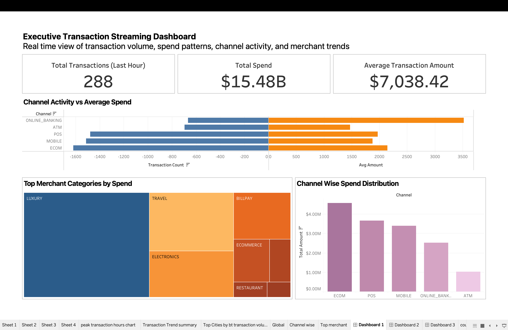
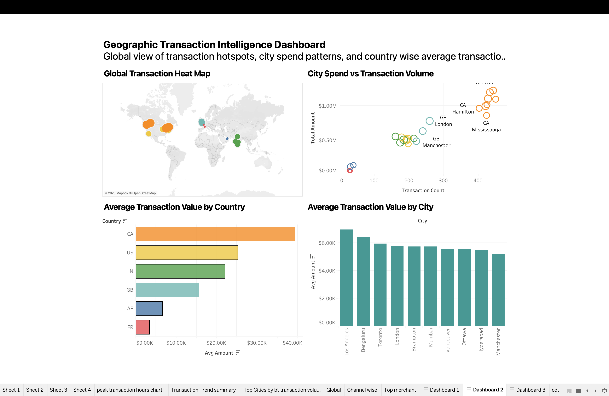

# Real-Time Banking Transaction Intelligence Platform

> An end-to-end data platform that ingests synthetic banking transactions in real time, lands them in a medallion-style lakehouse, runs ML for fraud and risk scoring, and exposes insights through BI dashboards and a natural-language chatbot.

**Stack:** Apache Kafka • PySpark Structured Streaming • Apache Iceberg • Apache Airflow • Azure Data Lake Storage Gen2 • Azure SQL • Snowflake • scikit-learn • Tableau • LangChain + Ollama • Docker

**Authors:** Faisal Ul Haque Mohammed, Darshil K Shah — M.A.C., Wilfrid Laurier University (2026)

---

## Why this project

Banks generate continuous, high-velocity transaction streams that need to be processed both for immediate decisions (fraud blocks, alerts) and for downstream analytics (segmentation, risk, executive reporting). Most student projects pick one slice of this — a Spark job, a Kafka demo, an ML notebook. This project builds the full vertical: ingestion → lakehouse → analytics → ML → BI → conversational interface, so the design trade-offs at each layer can be reasoned about as a single system.

---

## Architecture

## Dashboards

Three Tableau workbooks ship in `Tableau_BI_Dashboards/`:

- **Executive** — KPIs, trends, segment performance
- **Real-time** — transaction velocity, geographic heatmap, live fraud flags
- **Geography** — country/region drill-downs

### Executive


### Real-time


### Geography


The platform follows a **medallion architecture** over a Kafka + Spark + Iceberg backbone:

- **Producer** — a Python generator simulates realistic transaction events (customers, merchants, geography, fraud-injection) and publishes to Kafka.
- **Bronze** — raw Kafka events land in Azure Data Lake Storage Gen2 as Iceberg tables, partitioned by ingestion date.
- **Silver** — a PySpark Structured Streaming job cleans, deduplicates, and conforms schemas, with checkpointing for exactly-once semantics.
- **Gold** — Airflow-orchestrated batch jobs produce aggregated marts (customer 360, merchant scorecards, fraud signals) in Snowflake and Azure SQL.
- **ML layer** — scikit-learn pipelines train and score on the gold layer for segmentation, anomaly detection, and risk.
- **Serving** — Tableau dashboards read from Azure SQL; a LangChain agent backed by a local Ollama model answers natural-language questions over the marts.

---

## Features

- **Real-time ingestion** at ~N events/sec from a configurable Kafka producer
- **Lakehouse storage** with Iceberg time-travel and schema evolution on ADLS Gen2
- **Streaming bronze → silver** transformation with PySpark + checkpointed state
- **Airflow DAGs** for daily silver → gold marts, model retraining, and BI exports
- **Three ML use cases** running on the gold layer
- **Tableau dashboards** for executive, real-time, and geography views
- **Conversational analytics** via a LangChain + Ollama agent grounded in the marts

---

## Repository structure

```
producer/              Kafka transaction generator
consumer/              Spark streaming consumers (bronze → silver)
spark/streaming/       Structured Streaming jobs
pipelines/             Silver → gold transformations
airflow/               DAG definitions
airflow_docker/        Dockerized Airflow stack (compose, configs)
ml/                    Training scripts for segmentation / anomaly / risk
models/                Serialized model artifacts (gitignored in prod)
analytics/             Ad-hoc SQL and notebook analyses
bi_exports/            CSV/Parquet feeds for Tableau
Tableau_BI_Dashboards/ .twbx workbooks and screenshots
agentic_ai/            LangChain + Ollama chatbot service
infra/                 Cloud / IaC configuration (Azure, Snowflake)
metrics/               Job metrics and lineage outputs
docs/                  Architecture, design notes, screenshots
data/                  Schema files and sample reference data
```

---

## Quickstart

### Prerequisites
- Docker & Docker Compose
- Python 3.10+
- Azure subscription with ADLS Gen2 + Azure SQL provisioned
- A Snowflake account (or set the flag to skip Snowflake sinks)
- Ollama running locally for the chatbot (optional)

### 1. Clone and set up the Python environment

```bash
git clone https://github.com/faisalhaq02/Real-Time-Banking-Transaction-Intelligence-Platform-Using-Streaming-and-Lakehouse-Architecture.git
cd Real-Time-Banking-Transaction-Intelligence-Platform-Using-Streaming-and-Lakehouse-Architecture

python3 -m venv .venv
source .venv/bin/activate
pip install -r requirements.txt
```

### 2. Configure environment variables

Copy `.env.example` to `.env` and fill in:

```bash
# Kafka
KAFKA_BOOTSTRAP_SERVERS=localhost:9092

# Azure
AZURE_STORAGE_ACCOUNT_NAME=your_storage_account
AZURE_STORAGE_CONNECTION_STRING=your_connection_string
AZURE_SQL_SERVER=your-server.database.windows.net
AZURE_SQL_DATABASE=banking_intelligence_db
AZURE_SQL_USERNAME=your_username
AZURE_SQL_PASSWORD=your_password
AZURE_SQL_ODBC_DRIVER=ODBC Driver 18 for SQL Server

# Snowflake (optional)
SNOWFLAKE_ACCOUNT=
SNOWFLAKE_USER=
SNOWFLAKE_PASSWORD=
SNOWFLAKE_WAREHOUSE=
SNOWFLAKE_DATABASE=

# Airflow
AIRFLOW_UID=50000
```

### 3. Start the infrastructure

```bash
# Kafka + Spark + Airflow
docker compose -f airflow_docker/docker-compose.yml up -d
```

Airflow UI: <http://localhost:8080>

### 4. Run the streaming pipeline

```bash
# Producer
python producer/transaction_producer_v2.py

# Streaming consumer (bronze → silver)
python consumer/consumer_file.py
```

### 5. Trigger batch pipelines

In the Airflow UI, enable and trigger:
- `silver_to_gold_daily`
- `ml_training_weekly`
- `bi_export_daily`

### 6. Train ML models manually (optional)

```bash
python ml/train_models.py
```

### 7. Launch the chatbot

```bash
# Ensure Ollama is running with your chosen model
ollama run llama3

# Start the agent
python agentic_ai/app.py
```

---

## Machine learning

| Use case | Model(s) | Output |
|---|---|---|
| Customer segmentation | KMeans + PCA | Segment labels on the customer-360 mart |
| Anomaly / fraud detection | Isolation Forest, LOF, One-Class SVM | Per-transaction anomaly scores |
| Risk scoring | Random Forest classifier | Risk band (Low / Medium / High) per customer |

Training scripts live in `ml/`. Models are versioned in `models/` and consumed by the BI exports and the chatbot's tool layer.

---

## Dashboards

Three Tableau workbooks ship in `Tableau_BI_Dashboards/`:

- **Executive** — KPIs, trends, segment performance
- **Real-time** — transaction velocity, geographic heatmap, live fraud flags
- **Geography** — country/region drill-downs


---

## Conversational analytics

The `agentic_ai/` service runs a LangChain agent backed by a local Ollama LLM. The agent uses semantic routing over a set of tools that query the gold marts directly, so answers are grounded in the actual data rather than the model's prior. Conversation memory is maintained across turns within a session.

Example questions it can answer:
- *"Which merchant categories had the highest fraud rate last week?"*
- *"Show me the top 10 customers by risk score in Ontario."*
- *"How does transaction volume in Q4 compare to Q3?"*

---

## What this project is — and isn't

**It is** a working end-to-end data platform that demonstrates the components and trade-offs of a modern lakehouse: streaming ingestion, medallion layering, orchestration, ML, BI, and a natural-language interface, all over a banking domain.

**It is not** a production system. It does not include the observability, schema-registry enforcement, dead-letter queues, secret rotation, CI/CD, integration testing, or HA infrastructure that a real bank would require. The dataset is synthetic. The models are trained on that synthetic data and are illustrative, not deployable.

---

## Roadmap

- [ ] Replace synthetic generator with a public banking dataset for at least one validation pass
- [ ] Add Great Expectations data-quality checks at the silver layer
- [ ] Wire dbt for gold-layer transformations on Snowflake
- [ ] Add unit tests for transformations and an integration test for the producer → silver path
- [ ] Move secrets out of `.env` into Azure Key Vault
- [ ] Add a lightweight FastAPI wrapper around the chatbot

---

## Dataset

Synthetic transactions are generated by `producer/transaction_producer_v2.py`. A pre-generated reference dump is available here:

<https://drive.google.com/file/d/1Xa-Lte88z_kCO4P5ntrdEVGb3kNzulxs/view?usp=sharing>

Extract into `data/` before running.

---

## License

MIT. See `LICENSE`.

---

## Authors

- **Faisal Ul Haque Mohammed** — [github.com/faisalhaq02](https://github.com/faisalhaq02)
- **Darshil K Shah**

Master of Applied Computing, Wilfrid Laurier University (2026)
